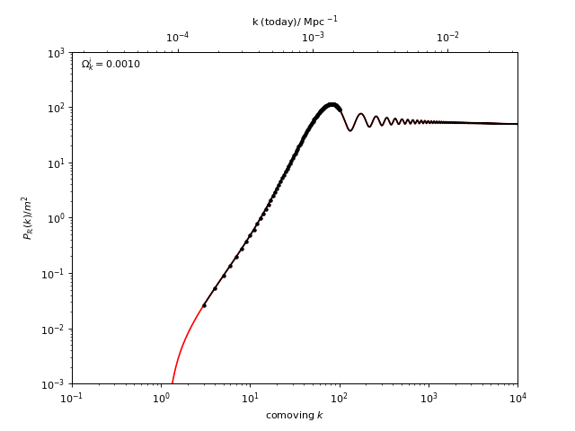

## oscode - fast numerical solution of **osc**illatory **o**rdinary **d**ifferential **e**quations

- [paper](https://arxiv.org/pdf/1906.01421.pdf) and [slides](https://fruzsinaagocs.github.io/images/IoA_Wednesday_talk.pdf) from a recent talk, [video summary](https://www.youtube.com/watch?v=u7E82j8UIM4)
- [open-source code](https://github.com/fruzsinaagocs/oscode) and its
  [documentation](https://oscode.readthedocs.io/en/latest/introduction.html)

`oscode` is a numerical routine that you can call from Python or C++; it is
built to (extremely efficiently) solve equations of the form \\[\label{eq:osc}
\ddot{x} + 2\gamma(t)\dot{x} + \omega^2(t)x = 0, \\] where $\omega(t)$ and
$\gamma(t)$ can be *explicit* functions of time, or just be computed numerically
and given as *arrays*.

In simple terms,`oscode` is faster than conventional solvers (e.g. `scipy.odeint.integrate`, or
`Mathematica`'s built-in solver) because it makes use of an analytic
approximation of $x(t)$ to skip over long regions of oscillations. This
approximation is valid when the frequency $\omega(t)$ changes slowly relative to
the timescales of integration, therefore it is worth applying `oscode` when this
condition holds for at least some part of the integration range.

Equations like (\ref{eq:osc}) are common in physics. The one-dimensional
Schroedinger equation has this form, as does the Mukhanov-Sasaki equation, which
allows us to compute *primordial power spectra* of curvature perturbations,
precursors of the anisotropies in the Cosmic Microwave Background (CMB). With `oscode`
it is possible to compute primordial power spectra much faster, allowing faster
inference of parameters in cosmological models. For example, the spectra below
belong to closed universes with increasing initial curvature - it would take
**$\geq $** **30 minutes** to compute one of these on my laptop with `scipy`, and
takes about **1 s** with `oscode`.

## Quantum initial conditions for inflation

- [paper](https://arxiv.org/abs/2002.07042) 

In numerical simulations of the early universe, primordial perturbations are
modelled and evolved from soon after the Big Bang until today. The simulations need to start the perturbations from some initial state (initial conditions), which depends on the way the quantum vacuum was defined. This definition is far from trivial on a time-dependent spacetime.

My work investigates different methods to define the ground
state on non-static spacetimes. Some of the well-known methods yield
different initial conditions for the perturbations under so-called *canonical transformations*.
The transformations I looked at were either 

- a variable transform in the action associated with the system,

or 

- an integration by parts in the action.

Canonical transformations *in classical mechanics* are used to find the best
parametrisation of the system, and to discover conserved quantities. They don't
change the equation of motion or anything physical - they are just coordinate
transformations. *In quantum field theory*, they don't change the dynamics of
the system, and interestingly, if the vacuum is unchanged under canonical
transformations then so will be the expectation values of quantum operators. The
contrary is also true, the expectation values will shift with the vacuum if it
isn't canonically invariant. 
This has been accepted as a property of the transformations, but it also
suggests that a vacuum formulation that is invariant under canonical
transformations should be used preferentially. I found a physically
well-motivated vacuum definition that is just like that, and it derives the
vacuum via minimising the energy-density part of the renormalised stress-energy
tensor.  
